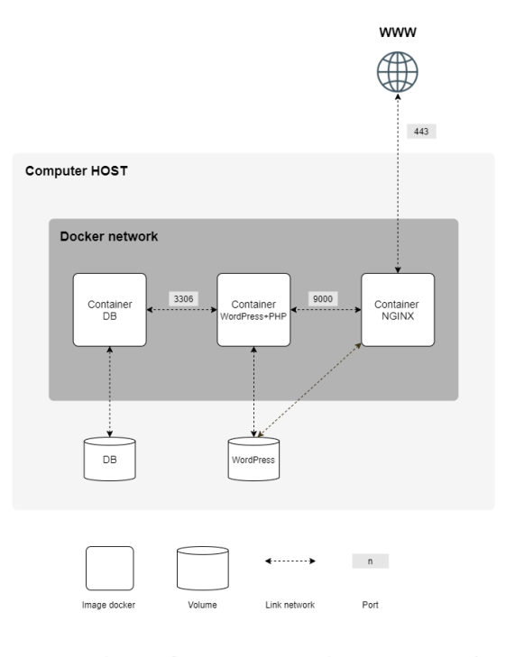

# My Humble Documentation of the Inception Project.

## Table of Contents

1. [Definitions](#1-definitions)
	- [General Definitions](#general-definitions)
	- [What is a Virtual Machine?](#what-is-a-virtual-machine)
	- [Problematic](#problematic)
	- [Solution: What is a Docker?](#solution-what-is-a-docker)
	- [What is a Container?](#what-is-a-container)
	- [What is a Docker Image?](#what-is-a-docker-image)
	- [What is a Dockerfile?](#what-is-a-dockerfile)
	- [What is Docker Compose?](#what-is-docker-compose)
	- [What is Docker Hub?](#what-is-docker-hub)
	- [What is Docker Swarm?](#what-is-docker-swarm)
	- [What are Docker Volumes?](#what-are-docker-volumes)
	- [What is Docker Machine?](#what-is-docker-machine)
	- [What is Docker Engine?](#what-is-docker-engine)
	- [What is Docker Client?](#what-is-docker-client)
	- [What is Docker Daemon?](#what-is-docker-daemon)

2. [Docker Installation](#2-docker-installation)
	- [Docker Installation on Mac](#docker-installation-on-mac)
	- [Docker Installation on Windows](#docker-installation-on-windows)
	- [Docker Installation on Ubuntu](#docker-installation-on-ubuntu)

3. [Dockerfile](#3-dockerfile)
	- [Dockerfile Instructions](#dockerfile-instructions)
	- [Dockerfile Best Practices](#dockerfile-best-practices)
	- [Dockerfile Example](#dockerfile-example)

4. [Docker Compose](#4-docker-compose)
	- [What is Docker Compose?](#what-is-docker-compose-1)
	- [How to use Docker Compose?](#how-to-use-docker-compose)


## 1. Definitions

#### General Definitions:

### What is a Virtual Machine?
A virtual machine, VM for short, is an emulation of a computer system on a physical computer in orde to emulate the functionality of another seperate computer. This allows us to run multiple operating systems on a single physical machine. 

The benefits of using a virtual machine are numerous, for example, we can run multiple operating systems on a single physical machine, allowing us to run software that is not compatible with our current operating system. We can also test software on multiple operating systems without having to buy multiple physical machines... 

### Problematic

While the benefits of using a virtual machine are numerous, there are also some drawbacks. For example, virtual machines are not as efficient as running software on a physical machine. This is because the virtual machine has to emulate the hardware of the physical machine, which is not as efficient as running the software directly on the physical machine. VMs are also slow to boot up, and require a lot of memory to run.

### Solution: What is a Docker?

The solution to the problematic of virtual machines is a Docker. While VM is virtualization of hardware, Docker is virtualization of operating system. It is a software containerization (We'll understand what containerization means later on) platform that allows us to run software in containers. 

In simpler terms, Docker allows and provides a way to package and run applications with their dependencies in a consistent and isolated environment, making it easier to develop, test, deploy and scale applications.

### What is a Container?

Containers are applications packaged with their depenedencies such as libraries, frameworks, etc. in an isolated environment. 

Containers are Processes, not Virtual Machines.

Containers are isolated from each other and from the host machine, but they share the same kernel with other containers.

### What is a Docker Image?

Much like Snapshots of a VM, a Docker Image is a read-only template that contains a set of instructions for creating a Docker Container in a specific state at a particular point of time.

Any changes made to a Docker Image will not affect the original image, but will just create another image layer on top of it.

### What is a Dockerfile?

Compared to Makefiles, Dockerfiles are also text-files that contain a set of commands and instructions for building a specific Docker Image. These instructions define the steps that are needed to set up the environment, install dependencies, configure the image, run the application, etc.

### What is Docker Compose?

Docker compose is a tool that allows for defining and running multi-container Docker applications. With Docker Compose, we can use a YAML file (file written with a language called YAML) to configure our application's services. Then, with a single command, we can create and start all the services from our configuration. This tool makes it super easy to run multiple Docker containers at once. 

It is important to note that Docker Compose is not a production-grade tool, and should not be used in production. It is only meant to be used for development and testing purposes.

### What is Docker Hub?

Docker Hub is a public container registry provided by Docker, Inc. It's a cloud-based service that serves as a central hub for storing and sharing Docker images. Developers use Docker Hub to upload (push) and download (pull) Docker images, making it a convenient and widely used platform for sharing containerized applications and components.

### What is Docker Swarm?

Docker swarm is a clustering (practice of combining multiple computers together to work as a single system) and orchestration (practice of automating the deployment, management, scaling, networking, and availability of containerized applications) tool for Docker containers. It allows for the creation and management of a cluster of Docker Nodes (Individual machines that run Docker) turning them into a single virtual Docker host.

### What are Docker Volumes?

Volumes are a way to store data in Docker containers. They are a special type of directory in a container that is stored outside of the Union File System and are used to persist data from a container. Similarly to a USB drive, volumes are mounted into containers and are accessible from within the container but are stored outside of the container's file system.

### What is Docker Machine?

Docker Machine is a utility that simplifies the installation and configuation of Docker on a virtual hosts. It allows ut to manage these hosts effortlessly, allowing us to create, start, stop and restart hosts, upgrade Docker, and a lot more.

### What is Docker Engine?

Much like a supervisor in a VM, Docker Engine is the core of Docker. It is a client-server application that builds and runs the Docker containers. It is a lightweight runtime and tooling that manages containers, images, volumes, and networks. It is the most important component of Docker and its base layer, and is responsible for creating and running Docker containers.

### What is Docker Client?

Docker Client, CLI for short, is a command-line tool that allows us to interact with the Docker Engine. It is the primary way that we interact with Docker. It sends commands to the Docker Daemon (We'll understand what a Docker Daemon in the next definition) and instructs it to perform tasks such as building, running, and distributing Docker containers.

### What is Docker Daemon?

Docker Daemon, dockerd for short, is a persistent background process that manages Docker containers on a host machine. It is responsible for listening to Docker API requests and managing Docker objects such as images, containers, networks, and volumes. It is actively managing and coordinating the activities of Docker containers.

## 2. Docker Installation

### Docker Installation on Mac

1. Download Docker Desktop for Mac from [here](https://hub.docker.com/editions/community/docker-ce-desktop-mac/).

2. Double-click Docker.dmg to open the installer, then drag Moby the whale to the Applications folder.

3. Follow the instructions on the installation wizard to authorize the installer and proceed with the install.

4. When the installation is successful, click the whale icon in the menu bar and select About Docker Desktop to verify that you have the latest version.

### Docker Installation on Windows

1. Download Docker Desktop for Windows from [here](https://hub.docker.com/editions/community/docker-ce-desktop-windows/).

2. Double-click Docker Desktop Installer.exe to run the installer.

3. Follow the instructions on the installation wizard to authorize the installer and proceed with the install.

4. When the installation is successful, click the whale icon in the Notifications area and select About Docker Desktop to verify that you have the latest version.

### Docker Installation on Ubuntu

1. Update the apt package index and install packages to allow apt to use a repository over HTTPS:

```
$ sudo apt-get update

$ sudo apt-get install \
	apt-transport-https \
	ca-certificates \
	curl \
	gnupg \
	lsb-release
```

2. Add Docker’s official GPG key:

```
$ curl -fsSL https://download.docker.com/linux/ubuntu/gpg | sudo gpg --dearmor -o /usr/share/keyrings/docker-archive-keyring.gpg
```

3. Use the following command to set up the stable repository:

```
$ echo \
	"deb [arch=amd64 signed-by=/usr/share/keyrings/docker-archive-keyring.gpg] https://download.docker.com/linux/ubuntu \
	$(lsb_release -cs) stable" | sudo tee /etc/apt/sources.list.d/docker.list > /dev/null
```

4. Update the apt package index, and install the latest version of Docker Engine and containerd:

```
$ sudo apt-get update

$ sudo apt-get install docker-ce docker-ce-cli containerd.io
```

5. Verify that Docker Engine is installed correctly by running the hello-world image:

```
$ sudo docker run hello-world
```

## 3. Dockerfile

### Dockerfile Instructions

As mentioned earlier, Dockerfiles are text-files that contain a set of commands and instructions for building a specific Docker Image. These instructions define the steps that are needed to set up the environment, install dependencies, configure the image, run the application, etc.

Basically, They are the recipe for building a Docker Image.

To write a Dockerfile, we need to use a set of instructions. These instructions are used to build a Docker Image. There are two types of instructions: general instructions and specific instructions.

General instructions are instructions that are used to set up the environment, install dependencies, etc. These instructions are not specific to Docker, and can be used in other contexts as well.

Examples of general instructions are:

- FROM
- RUN
- COPY
- ADD
- ENV
- WORKDIR

Specific instructions are instructions that are specific to Docker. These instructions are used to build a Docker Image.

Examples of specific instructions are:

- EXPOSE
- CMD
- ENTRYPOINT
- VOLUME

###### A basic Dockerfile should contain the following instructions:

##### Specify the base image
```
FROM *Specifies the base image*
```

##### Set the working directory
```
WORKDIR *Sets the working directory*
```

##### Copy the files
```
COPY *Copies files from the host machine to the container*
```

##### Install dependencies
```
RUN *Installs dependencies*
```

##### Expose the port
```
EXPOSE *Exposes the port*
```

##### Set the entrypoint /*Entrypoint is the command that is executed when the container is started*/
```
ENTRYPOINT *Sets the entrypoint*
```

##### Set the command /*Command is the command that is executed when the container is started*/
```
CMD *Sets the command*
```

##### Build Your Image
```
docker build -t <image-name> <path-to-dockerfile>
```

##### Run Your Image
```
docker run <image-name>
```

To highlight the difference between CMD and ENTRYPOINT, It should be noted that CMD sets default command and/or parameters, which can be overridden when running the container while ENTRYPOINT sets the main command and parameters that cannot be easily overridden when running the container.

Our File should look something like this:

```
# We'll take the official Node.js image as our base image
FROM node:14.17.0-alpine3.13 
WORKDIR /app

COPY package.json .
RUN npm install
EXPOSE 8000

CMD ["npm", "start"]
```

in bash:
```
$ docker build -t my-app .
$ docker run -p 8000:8000 my-app
```

### Dockerfile Best Practices

A good Dockerfile should be written in a way that is easy to read and understand. It should be well-structured and organized, and should follow the best practices.

Here are some best practices for writing a Dockerfile:

##### Use the official base image for your application

Begin with official base images, like FROM node:14.17.0-alpine3.13, and be specific about the version.

##### Use the WORKDIR instruction early on to set the working directory 

Use WORKDIR to set a clear working directory for subsequent commands.

##### Copy Smartly

Copy only what your app needs, using specific patterns like COPY package*.json ./.

##### Combine RUN commands to reduce layers

Use && to combine multiple commands in a single RUN instruction for efficiency.

##### Remove unused dependencies to minimize image size

Pretty self-explanatory.

##### Use .dockerignore

Create a .dockerignore file to exclude unnecessary files from being copied.

##### Include health checks for better container reliability.

Include health checks (HEALTHCHECK) to ensure your app is running properly.

##### Consider using multi-stage builds for smaller final images.

Use multi-stage builds for smaller final images, especially if you have a build stage and a runtime stage.

Using these best practices will help you write a Dockerfile that is easy to read and understand, and will help you avoid common mistakes.

### Dockerfile Example

```
# Start with an official Node.js image
FROM node:14.17.0-alpine3.13

# Set the working directory
WORKDIR /app

# Copy package.json and package-lock.json to the working directory
COPY package*.json ./

# Install dependencies, build the application, and remove unnecessary development dependencies in one step
RUN npm install && \
    npm run build && \
    npm prune --production

# Copy the rest of the application code
COPY . .

# Expose port 3000 (assuming your app runs on this port)
EXPOSE 3000

# Set environment variables (optional)
ENV NODE_ENV=production

# Healthcheck to ensure the application is running
HEALTHCHECK --interval=30s --timeout=3s CMD curl -f http://localhost:3000 || exit 1

# Start the application when the container starts
CMD ["npm", "start"]
```

## 4. Docker Compose

### What is Docker Compose?

Docker Compose is a tool that allows for defining and running multi-container (multiple containers that work together) Docker applications. This last allows us to use a YAML file (file written with a language called YAML) to configure our application's services. Then, with a single command, we can create and start all the services from our configuration. This tool makes it super easy to run multiple Docker containers at once. We can also use Docker Compose to scale our application's services, run a one-off command on a service, and more.

### How to use Docker Compose?

To use Docker Compose, we need to create a YAML file called docker-compose.yml. A YAML file looks something like this:

```
version: '3'  # Specify the version of Docker Compose syntax

services:
  web:
    image: nginx:latest  # Use the latest version of the Nginx image from Docker Hub
    ports:
      - "80:80"  # Map port 80 on the host to port 80 on the container

  db:
    image: mysql:latest  # Use the latest version of the MySQL image
    environment:
      MYSQL_ROOT_PASSWORD: examplepassword  # Set the root password for MySQL
      MYSQL_DATABASE: mydatabase  # Create a database named 'mydatabase'
      MYSQL_USER: user  # Create a MySQL user
      MYSQL_PASSWORD: password  # Set the password for the MySQL user
```

Now, that is what a basic docker-compose.yml file looks like. Let's break it down.

The first line specifies the version of Docker Compose syntax. This is important because Docker Compose supports multiple versions of the syntax, and we need to specify which version we are using.

The second line specifies the services that we want to run. In our case, we have two services: web and db. Each service has a name, an image, a set of environment variables, and a set of ports that we want to map.

The web service uses the latest version of the NGINX image from the docker hub. It maps port 80 of the host machine to port 80 of the container, which means that we can access the NGINX server running in the container on port 80 of the host machine.

Whereas, the db service (database) uses to latest version of the mySQL image from the docker hub. It sets a bunch of environment variables that are used to configure the mySQL server, such as the root password, name, user, and password of the database.

To run the services defined in the docker-compose.yml file, we use the following command:

```
docker-compose up
```

This command will create the docker containers for the services, the network that binds them all together, and start the services. If we want to stop them, we use the following command:

```
docker-compose down
```

To execute a one-off command on a service, we use the following command:

```
docker-compose run <service-name> <command>
```

To access the shell of a service, we use the following command:

```
docker-compose exec <service-name> sh
```

To access the logs of a service, we use the following command:

```
docker-compose logs <service-name>
```

To learn more about the commands and options available in Docker Compose, we can use the following command:

```
docker-compose --help
```

## Project Guidelines

This project consists in having you set up a small infrastructure composed of different services under specific rules. The whole project has to be done in a virtual machine. You have to use docker compose.

Each Docker image must have the same name as its corresponding service.
Each service has to run in a dedicated container.
For performance matters, the containers must be built either from the penultimate stable
version of Alpine or Debian. The choice is yours.
You also have to write your own Dockerfiles, one per service. The Dockerfiles must
be called in your docker-compose.yml by your Makefile.
It means you have to build yourself the Docker images of your project. It is then forbidden to pull ready-made Docker images, as well as using services such as DockerHub
(Alpine/Debian being excluded from this rule).

You then have to set up:
• A Docker container that contains NGINX with TLSv1.2 or TLSv1.3 only.
• A Docker container that contains WordPress + php-fpm (it must be installed and
configured) only without nginx.
• A Docker container that contains MariaDB only without nginx.
• A volume that contains your WordPress database.
• A second volume that contains your WordPress website files.
• A docker-network that establishes the connection between your containers.
Your containers have to restart in case of a crash.

Using network: host or --link or links: is forbidden. The network line must be present in your docker-compose.yml file. Your containers musn’t be started with a command running an infinite loop. Thus, this also applies to any command used as entrypoint, or used in entrypoint scripts. The following are a few prohibited hacky patches: tail -f, bash, sleep infinity, while true.

• In your WordPress database, there must be two users, one of them being the administrator. The administrator’s username can’t contain admin/Admin or administrator/Administrator (e.g., admin, administrator, Administrator, admin-123, and
so forth).

Your volumes will be available in the /home/login/data folder of the host machine using Docker. Of course, you have to replace the login with yours.

To make things simpler, you have to configure your domain name so it points to your local IP address. This domain name must be login.42.fr. Again, you have to use your own login. For example, if your login is wil, wil.42.fr will redirect to the IP address pointing to wil’s website.

The latest tag is prohibited.
No password must be present in your Dockerfiles.
It is mandatory to use environment variables.
Also, it is strongly recommended to use a .env file to store
environment variables. The .env file should be located at the root
of the srcs directory.
Your NGINX container must be the only entrypoint into your
infrastructure via the port 443 only, using the TLSv1.2 or TLSv1.3
protocol.

The expect result is as follows:



Below is an example of the expected directory structure:

```sh
$> ls -alR

total XX
drwxrwxr-x 3 wil wil 4096 avril 42 20:42 .
drwxrwxrwt 17 wil wil 4096 avril 42 20:42 ..
-rw-rw-r-- 1 wil wil XXXX avril 42 20:42 Makefile
drwxrwxr-x 3 wil wil 4096 avril 42 20:42 srcs

./srcs:
total XX
drwxrwxr-x 3 wil wil 4096 avril 42 20:42 .
drwxrwxr-x 3 wil wil 4096 avril 42 20:42 ..
-rw-rw-r-- 1 wil wil XXXX avril 42 20:42 docker-compose.yml
-rw-rw-r-- 1 wil wil XXXX avril 42 20:42 .env
drwxrwxr-x 5 wil wil 4096 avril 42 20:42 requirements

./srcs/requirements:
total XX
drwxrwxr-x 5 wil wil 4096 avril 42 20:42 .
drwxrwxr-x 3 wil wil 4096 avril 42 20:42 ..
drwxrwxr-x 4 wil wil 4096 avril 42 20:42 bonus
drwxrwxr-x 4 wil wil 4096 avril 42 20:42 mariadb
drwxrwxr-x 4 wil wil 4096 avril 42 20:42 nginx
drwxrwxr-x 4 wil wil 4096 avril 42 20:42 tools
drwxrwxr-x 4 wil wil 4096 avril 42 20:42 wordpress

./srcs/requirements/mariadb:
total XX
drwxrwxr-x 4 wil wil 4096 avril 42 20:45 .
drwxrwxr-x 5 wil wil 4096 avril 42 20:42 ..
drwxrwxr-x 2 wil wil 4096 avril 42 20:42 conf
-rw-rw-r-- 1 wil wil XXXX avril 42 20:42 Dockerfile
-rw-rw-r-- 1 wil wil XXXX avril 42 20:42 .dockerignore
drwxrwxr-x 2 wil wil 4096 avril 42 20:42 tools
[...]

./srcs/requirements/nginx:
total XX
drwxrwxr-x 4 wil wil 4096 avril 42 20:42 .
drwxrwxr-x 5 wil wil 4096 avril 42 20:42 ..
drwxrwxr-x 2 wil wil 4096 avril 42 20:42 conf
-rw-rw-r-- 1 wil wil XXXX avril 42 20:42 Dockerfile
-rw-rw-r-- 1 wil wil XXXX avril 42 20:42 .dockerignore
drwxrwxr-x 2 wil wil 4096 avril 42 20:42 tools
[...]

$> cat srcs/.env
DOMAIN_NAME=wil.42.fr
# certificates
CERTS_=./XXXXXXXXXXXX
# MYSQL SETUP
MYSQL_ROOT_PASSWORD=XXXXXXXXXXXX
MYSQL_USER=XXXXXXXXXXXX
MYSQL_PASSWORD=XXXXXXXXXXXX
[...]
$>
```

For obvious security reasons, any credentials, API keys, env variables etc... must be saved locally in a .env file and ignored by git. Publicly stored credentials will lead you directly to a failure of the project.

## My Approach

First, We're going to create a directory structure as shown above. Then, we're going to create a Dockerfile for each service. We're also going to create a docker-compose.yml file that will define the services, volumes, and networks. All the files will be called in the Makefile, and they will be found in the srcs directory.

### NGINX Service

To start, I have created a 'web' directory. This directory will contain the Dockerfile for the NGINX service with the TLSv1.2 or TLSv1.3 protocol. I have pulled a stable Debian image, updated and upgraded the packages, installed NGINX along with OpenSSL, and deleted the /var/lib/apt/lists/ directory's content to reduce the image size.

I have generated a self-signed certificate using the OpenSSL command, and I have copied the certificate to the /etc/ssl/certs/ directory, and the key to the /etc/ssl/private/ directory. The command to generate the certificate is as follows:

```sh
openssl req -x509 -nodes -days 365 -newkey rsa:2048 -keyout selfsigned.key -out selfsigned.crt
```

I have also created a nginx.conf file that contains the configuration for the NGINX service. A basic file should look something like this:

```conf
events {

}

http {
    include /etc/nginx/mime.types;

    server {
        listen 443 ssl http2;
        server_name agoujdam.42.fr;

        ssl_protocols TLSv1.3;
        ssl_certificate /etc/ssl/certs/selfsigned.crt;
        ssl_certificate_key /etc/ssl/private/selfsigned.key;   
    }
}
```

I made sure to expose port 443 in the Dockerfile and set a CMD to start the NGINX service, with the -g daemon off; directive to run NGINX in the foreground. This means that the NGINX service will run in the container, and the container will not exit immediately after starting the service.

In our docker-compose.yml file, I have defined the NGINX service, mapped port 443 of the host machine to port 443 of the container, and set the restart policy to always, so that the container restarts in case of a crash. 

We should not forget to forward the website's domain name "agoujdam.42.fr" to the local IP address. This can be done by adding the following line to the /etc/hosts file:

```
127.0.0.1	agoujdam.42.fr
```
